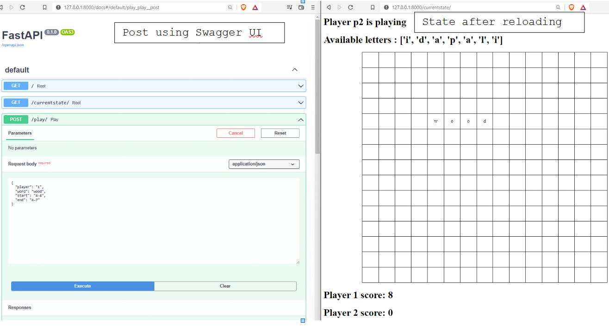

<br />
<div align="center">
  <a>
    
  </a>

  <h3 align="center">Scrabbled API's</h3>

  <p align="center">
    A PoC API built on Python based on the famous Scrabble game
    <br />
  </p>
</div>


<!-- ABOUT THE PROJECT -->
## Project description
The project consist of a basic backend which is deployed locally. The idea is to create a simulation of the Scrabble game, where certain endpoints are exposed to interact with tha game.

The rules are pretty simpliefied, since the idea behid the project is to check the development level rather than build a production ready game. These are:

* At the start of the game the available letters are taken from the master database, `letters.json`.
* Each player is dealt a randomly chosen of 7 letters.
* Player 1 plays first
* The player can place **ONE** word respecting the following rules:
    * If the board is not empty, the word placement should reuse **AT LEAST** on of the previousy placed tiles
    * The word must be placed horizontally or vertically.
* After each turn the letters of the player are replenished back to 7.
* The score of the player is increased according to the indivudual values of each letter
* Once there are no remaining letters in the reserve **THE GAME ENDS** with the player having the highest score being the winner
* No word checking, no diciotnairy, no multipliers

### Built With

All the stack is based on Python libraries, for handling the HTTP requests, the logic, the storage of the current stage in a persistent manner and the rendering of a super simplistic front-end to help the testing ([MVC](https://www.geeksforgeeks.org/mvc-design-pattern/)). The libraries are the following

* [FastAPI](https://fastapi.tiangolo.com/)
* [Uvicorn](https://www.uvicorn.org/)
* [pydantic](https://pydantic-docs.helpmanual.io/)
* [Jinja2](https://palletsprojects.com/p/jinja/)

## Getting Started


### Prerequisites

Since FastAPI depends on all of the non standard libraries, the only prerequisite in order to prepare the development environement is the following:

  ```sh
  pip install fastapi[all]
  ```

### Fire up the server

To have the server running one needs to:

1. Clone the repo
   ```sh
   git clone https://github.com/dimkary/metry-scrabble-challenge.git
   ```
2. Go to root directory
   ```sh
   cd metry-scrabble-challenge
   ```
3. Run the server locally using debug and reload mode (both optional)
   ```sh
   uvicorn app:app --reload --debug
   ```
   Where *app* is the variable reference of the FastAPI instance, declared in the `app.py` file.

## Usage

The root URL of the server is http://127.0.0.1:8000/. Apart from the root, two endpoints have been set-up:

* **POST** http://127.0.0.1:8000/play/ Perform the next play
* **GET** http://127.0.0.1:8000/currentstate/ Check the current state of the board
    * Who is playing
    * What are the available letters of the current player
    * The letters placed on the board

The specifications of the required payload can be viewed in the automatically craeted API http://127.0.0.1:8000/docs from FastAPI which uses the [SwaggerUI](https://swagger.io/tools/swagger-ui/) for API schemeta definitions and testing interfaces.

  <a>
    
  </a>

## Software workflow
The backend units are programmed in a way to handle a plethora of invalid requests (wrong player, word that cannot be derived from the given letters etc.). While this graph in far from granular, it can give a basic idea on the underlying flow.

  <a>
    
  </a>

## Final thoughts

The project is far from complete, and further testing + security features should be implemented. While the code contains many assertions, a thorough pen test would be required to ensure the robsutness of the app. Moreover a next step would be to containerize it.
## Contact

Your Name - Dimitrios Karypidis - dim.karypidis@outlook.com

Project Link: [https://github.com/dimkary/metry-scrabble-challenge](https://github.com/dimkary/metry-scrabble-challenge)

<p align="right">(<a href="#top">back to top</a>)</p>
